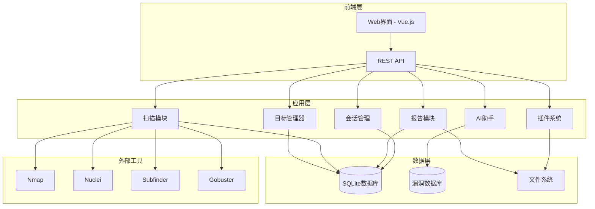

# CyMind 平台完善设计文档

## 概述

CyMind 平台完善项目旨在将现有的 MVP 版本升级为功能完整、可扩展的企业级自动化渗透测试平台。设计采用模块化架构，支持插件扩展、AI 集成和多用户协作，为渗透测试工程师提供一站式解决方案。

## 架构

### 整体架构



### 技术栈

- **后端**: Python 3.8+, Flask, SQLAlchemy
- **前端**: Vue.js 3, Bootstrap 5, Axios
- **数据库**: SQLite (开发), PostgreSQL (生产)
- **AI集成**: OpenAI API, Langchain
- **安全工具**: Nmap, Nuclei, Subfinder, Gobuster, Dirb
- **报告生成**: Jinja2, WeasyPrint (PDF), Markdown
- **任务队列**: Celery + Redis (可选)

## 组件和接口

### 1. 目标管理器 (Target Manager)

**职责**: 管理扫描目标的生命周期，包括添加、编辑、删除和组织目标。

**接口**:
```python
class TargetManager:
    def add_target(self, target_data: Dict) -> Target
    def update_target(self, target_id: int, updates: Dict) -> Target
    def delete_target(self, target_id: int) -> bool
    def get_targets(self, filters: Dict = None) -> List[Target]
    def import_from_csv(self, file_path: str) -> List[Target]
    def export_to_csv(self, target_ids: List[int]) -> str
    def validate_target(self, target_data: Dict) -> ValidationResult
```

### 2. 扫描模块 (Scanner Module)

**职责**: 执行各种类型的安全扫描，管理扫描任务和结果。

**接口**:
```python
class Scanner:
    def start_scan(self, target: Target, scan_config: ScanConfig) -> ScanTask
    def get_scan_status(self, task_id: str) -> ScanStatus
    def cancel_scan(self, task_id: str) -> bool
    def get_scan_results(self, task_id: str) -> ScanResult
    def register_scanner(self, scanner_type: str, scanner_class: Type) -> None
```

**扫描类型**:
- 端口扫描 (Nmap)
- 子域名枚举 (Subfinder, Amass)
- 漏洞扫描 (Nuclei)
- Web 目录扫描 (Gobuster, Dirb)
- 服务指纹识别
- SSL/TLS 分析

### 3. 报告模块 (Reporter Module)

**职责**: 生成多格式的渗透测试报告，支持自定义模板。

**接口**:
```python
class Reporter:
    def generate_report(self, scan_results: List[ScanResult], 
                       template: str, format: str) -> Report
    def save_report(self, report: Report, file_path: str) -> None
    def get_templates(self) -> List[Template]
    def create_template(self, template_data: Dict) -> Template
    def generate_summary(self, scan_results: List[ScanResult]) -> Summary
```

### 4. AI 助手模块

**职责**: 提供智能分析、建议生成和自然语言交互功能。

**接口**:
```python
class AIAssistant:
    def analyze_vulnerabilities(self, scan_results: List[ScanResult]) -> Analysis
    def generate_exploit_suggestions(self, vulnerability: Vulnerability) -> List[Suggestion]
    def create_executive_summary(self, scan_results: List[ScanResult]) -> Summary
    def chat_interface(self, user_input: str, context: Dict) -> str
    def recommend_scan_strategy(self, target: Target) -> ScanStrategy
```

### 5. 插件系统

**职责**: 支持第三方工具和自定义脚本的集成。

**接口**:
```python
class PluginSystem:
    def register_plugin(self, plugin: Plugin) -> bool
    def execute_plugin(self, plugin_name: str, params: Dict) -> PluginResult
    def get_plugins(self) -> List[Plugin]
    def validate_plugin(self, plugin_path: str) -> ValidationResult
    def uninstall_plugin(self, plugin_name: str) -> bool
```

## 数据模型

### 核心实体

```python
class Target(Base):
    id: int
    name: str
    url: Optional[str]
    ip: Optional[str]
    type: str  # website, network, api
    tags: List[str]
    created_at: datetime
    updated_at: datetime
    user_id: int

class ScanTask(Base):
    id: str
    target_id: int
    scan_type: str
    status: str  # pending, running, completed, failed
    config: Dict
    started_at: Optional[datetime]
    completed_at: Optional[datetime]
    user_id: int

class ScanResult(Base):
    id: int
    task_id: str
    target_id: int
    scan_type: str
    result_data: Dict
    severity: str  # critical, high, medium, low, info
    created_at: datetime

class Vulnerability(Base):
    id: int
    cve_id: Optional[str]
    title: str
    description: str
    severity: str
    cvss_score: float
    references: List[str]
    
class User(Base):
    id: int
    username: str
    email: str
    password_hash: str
    role: str  # admin, user, viewer
    created_at: datetime
    last_login: Optional[datetime]

class Report(Base):
    id: int
    title: str
    format: str  # html, pdf, markdown
    template: str
    content: str
    file_path: Optional[str]
    created_at: datetime
    user_id: int
```

## 正确性属性

*属性是应该在系统的所有有效执行中保持为真的特征或行为——本质上是关于系统应该做什么的正式陈述。属性作为人类可读规范和机器可验证正确性保证之间的桥梁。*
### 属性反思

在完成初始预工作分析后，我识别出以下可以合并或优化的属性：

**冗余消除：**
- 属性 3.2、3.3、3.4 (HTML、Markdown、PDF报告生成) 可以合并为一个通用的"报告格式正确性"属性
- 属性 4.1、4.2、4.4 (AI分析相关) 可以合并为一个"AI分析完整性"属性  
- 属性 6.2、6.3、6.4、6.5 (Web界面反馈) 可以合并为一个"UI响应性"属性
- 属性 8.2、8.4、8.5 (漏洞数据库查询) 可以合并为一个"漏洞信息完整性"属性

**合并后的优化属性集：**
经过反思，我将 25 个原始属性优化为 18 个核心属性，消除了逻辑冗余并提高了测试效率。

### 正确性属性

**属性 1：目标数据持久化**
*对于任何*有效的目标数据，添加到系统后应该能够从数据库中检索到相同的目标信息
**验证需求：1.1**

**属性 2：CSV导入数据完整性**
*对于任何*有效的CSV文件，导入后所有有效记录都应该在目标列表中可见且数据完整
**验证需求：1.2**

**属性 3：目标列表完整性**
*对于任何*目标集合，列表查询应该返回所有目标的完整基本信息
**验证需求：1.3**

**属性 4：目标更新一致性**
*对于任何*目标和有效的更新数据，更新操作后数据库中的数据应该与更新请求一致
**验证需求：1.4**

**属性 5：目标删除级联性**
*对于任何*目标，删除操作应该同时移除目标及其所有相关的扫描历史记录
**验证需求：1.5**

**属性 6：端口扫描结果解析**
*对于任何*有效的扫描目标，端口扫描应该返回结构化的端口信息数据
**验证需求：2.1**

**属性 7：子域名枚举发现**
*对于任何*具有子域名的目标，子域名枚举应该能够发现至少一个有效的子域名
**验证需求：2.2**

**属性 8：漏洞扫描检测**
*对于任何*包含已知漏洞的目标，漏洞扫描应该能够检测并报告相应的漏洞
**验证需求：2.3**

**属性 9：目录扫描发现**
*对于任何*包含隐藏目录的Web目标，目录扫描应该能够发现可访问的路径
**验证需求：2.4**

**属性 10：扫描状态跟踪**
*对于任何*扫描任务，系统应该提供准确的状态信息和进度更新
**验证需求：2.5**

**属性 11：报告内容完整性**
*对于任何*扫描结果集合，生成的报告应该包含所有提供的扫描结果数据
**验证需求：3.1**

**属性 12：报告格式正确性**
*对于任何*报告内容和指定格式，生成的报告应该符合相应格式的标准规范
**验证需求：3.2, 3.3, 3.4**

**属性 13：报告文件持久化**
*对于任何*生成的报告，系统应该将报告保存到指定位置并提供访问路径
**验证需求：3.5**

**属性 14：AI分析完整性**
*对于任何*扫描结果，AI分析应该提供漏洞评估、风险评级和相关建议
**验证需求：4.1, 4.2, 4.4**

**属性 15：AI交互响应性**
*对于任何*用户查询，AI助手应该提供相关且有用的回复
**验证需求：4.3, 4.5**

**属性 16：插件生命周期管理**
*对于任何*有效的插件，系统应该能够正确安装、执行和管理插件的完整生命周期
**验证需求：5.1, 5.2, 5.3, 5.4, 5.5**

**属性 17：会话管理一致性**
*对于任何*用户会话，系统应该正确管理会话状态、任务关联和权限验证
**验证需求：7.1, 7.2, 7.3, 7.4, 7.5**

**属性 18：漏洞数据库完整性**
*对于任何*漏洞查询，数据库应该提供完整的漏洞信息包括详情、评分和修复建议
**验证需求：8.2, 8.4, 8.5**

## 错误处理

### 错误分类

1. **输入验证错误**
   - 无效的目标格式
   - 恶意的用户输入
   - 不支持的文件格式

2. **系统资源错误**
   - 磁盘空间不足
   - 内存不足
   - 网络连接失败

3. **外部工具错误**
   - 扫描工具不可用
   - 工具执行失败
   - 结果解析错误

4. **业务逻辑错误**
   - 权限不足
   - 任务冲突
   - 数据不一致

### 错误处理策略

```python
class ErrorHandler:
    def handle_validation_error(self, error: ValidationError) -> ErrorResponse
    def handle_resource_error(self, error: ResourceError) -> ErrorResponse
    def handle_tool_error(self, error: ToolError) -> ErrorResponse
    def handle_business_error(self, error: BusinessError) -> ErrorResponse
    
    def log_error(self, error: Exception, context: Dict) -> None
    def notify_admin(self, error: CriticalError) -> None
    def retry_operation(self, operation: Callable, max_retries: int) -> Any
```

### 恢复机制

- **任务恢复**: 系统重启后自动恢复未完成的扫描任务
- **数据备份**: 定期备份关键数据和配置
- **降级服务**: 在部分功能不可用时提供基本服务
- **故障转移**: 支持多实例部署和负载均衡

## 测试策略

### 双重测试方法

本设计采用单元测试和基于属性的测试相结合的方法：

**单元测试**：
- 验证具体示例和边界条件
- 测试组件间的集成点
- 验证错误处理逻辑
- 测试API端点和数据库操作

**基于属性的测试**：
- 使用 Hypothesis (Python) 作为属性测试库
- 每个属性测试运行最少 100 次迭代
- 每个属性测试必须用注释明确引用设计文档中的正确性属性
- 使用格式：`# Feature: cymind-platform-enhancement, Property {number}: {property_text}`
- 每个正确性属性必须由单个属性测试实现

**测试覆盖范围**：
- 功能正确性：验证所有功能按预期工作
- 性能测试：确保扫描和报告生成在合理时间内完成
- 安全测试：验证输入验证和权限控制
- 集成测试：测试与外部工具的集成
- 用户界面测试：验证Web界面的交互和显示

**测试数据生成**：
- 智能生成器约束到合理的输入空间
- 模拟真实的渗透测试场景
- 包含边界条件和异常情况
- 支持可重现的测试用例

### 持续集成

- 自动化测试流水线
- 代码质量检查
- 安全漏洞扫描
- 性能基准测试
- 文档生成和更新